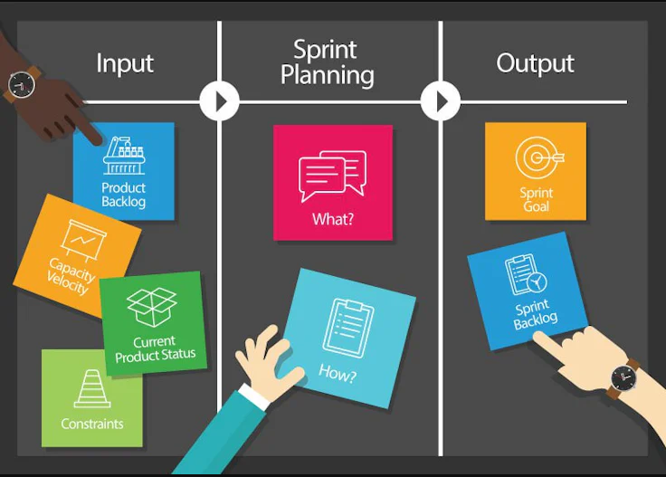

# Sprint 

- itération de travail

## Sprint planning 

- Une réunion qui lance chaque itération de travail, ou "sprint". 
  - Cette pratique permet aux équipes de 
    - définir clairement leurs objectifs, 
    - de hiérarchiser les tâches 
    - et de se mettre d'accord sur un plan d'action pour les prochaines semaines.

- Le sprint planning meeting est la première réunion de chaque sprint, ou cycle de développement, qui dure en général de deux semaines à un mois et pendant lequel les développeurs vont concevoir et tester de nouvelles fonctionnalités.
  - Les réunions suivantes sont :
    - le daily scrum, chaque jour, pour faire un point sur les progressions et les points bloquants ;
    - la sprint review, la présentation des livrables au client et la collecte de ses retours ; 
    - la sprint retrospective, le point sur le sprint passé et les axes d’amélioration pour l’organisation des suivants.

## Références 
- [Sprint planning : rien ne sert à votre équipe de courir, il faut qu’elle parte à point,2021](https://www.appvizer.fr/magazine/operations/gestion-de-projet/sprint-planning)
- [3 conseils pour planifier les sprints de votre projet agile,2020](https://www.qrpinternational.fr/blog/methode-agile/3-conseils-pour-planifier-les-sprints-de-votre-projet-agile/)
- 